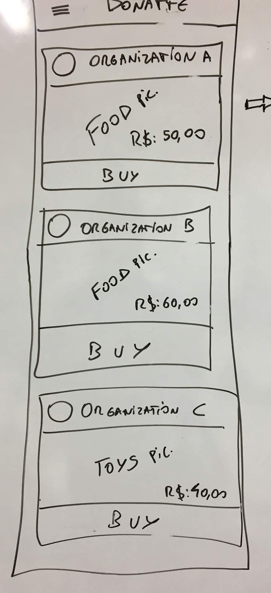

# ReactJS Test

Your will create an web charity aplication for non governmental organizations. 
Your aplication should run at web browsers like Firefox, chrome...
## Requirement
You need know JavaScript and ReacJS basic

## The web aplication should have:
- A products list
- User can choose and buy a product to an organization
- User can select the product amount
- User should receive a confimation message
- (Opitional) User receive a confirmation email with the purshase info.

## You should follow the sites below:
1. https://nodejs.org/en/download/  _node and npm install_
1. https://reactjs.org/ _React JS instructions_
1. https://github.com/facebook/create-react-app _create-react-app tool_
1. https://v0.material-ui.com/#/ _A library for UI React components_
1. https://blog.rocketseat.com.br/react-material-ui/ _A example of react + materialUI_

## Setup
1. You need install `node` and `npm` at your pc
1. Follow create-react-app instructions for creating your first app. 
Example: 

`npx create-react-app ongDonatteApp`

`cd ongDonatteApp`

`npm start`

1. https://blog.rocketseat.com.br/react-material-ui/
## Mockups
You have to follow the mockus below:

## Please send us questions about the test
contato@solidareasy.com

## At the end we gonna look for your creativity and experience. Don't worry if you don't finish all. Send us all of you have did.

Good Luck!